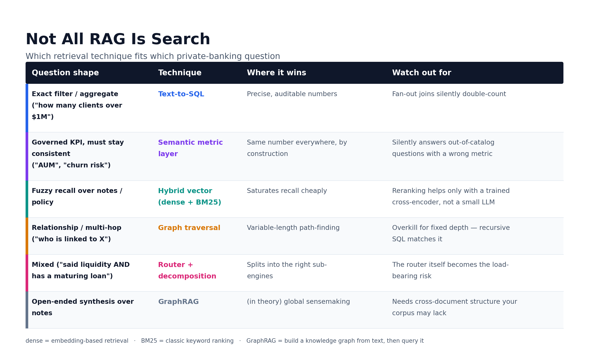

# RM Copilot — Wealth / Private-Banking RM Assistant (prototype)


A prototype that treats **RAG retrieval as a *plural* search problem** and converges on a
**routed hybrid** architecture for a synthetic private bank — then spends most of its effort on
making the conclusions, including the *negative* ones, trustworthy.



The project is two layers, and that is the through-line worth reading for:

- **Object level — plural retrieval.** No single index wins. A query router (F) dispatches to
  text-to-SQL (B), hybrid dense+BM25 vector (A), a governed metric layer (E), a Customer-360 brief
  (D), or graph traversal — each used only where it earns its keep, with the value *measured*
  (including honest negatives: a small LLM reranker net-hurts, a graph engine pays off only for
  variable-length path-finding, GraphRAG deferred for lack of a precondition).
- **Meta level — anti-circular evaluation (the real product).** On synthetic data the hard part is
  avoiding circular self-evaluation. The discipline — decouple gold authorship from the technique,
  separate model *capability* from LLM-*authoring* skill, pre-register verdicts, report the
  distribution when a threshold is straddled, vary the data knob not just the seed, and defer when a
  fair test isn't constructible — is what makes the negatives believable.

## Start here

| If you want… | Read |
|---|---|
| The full write-up + verdicts (the main narrative) | **`docs/TECHNICAL_REPORT.md`** |
| Per-experiment scoreboards | `docs/experiments/` (router, scoreboard, kg_experiment, kg_sensitivity, rerank_eval, rerank_sensitivity, semantic_eval/stability, semrepr_eval, coverage_map) |
| The original design spec (historical) | `docs/RM_Assistant_RAG_spec.md` |
| Conventions, invariants, gotchas | `CLAUDE.md` |
| Methodology retros (lessons per project) | `docs/retros/` |

## What's built

The routed hybrid answers all eight query archetypes (Q1–Q8) end-to-end. Headline results, all in
the report:

- **Router (F)** routes correctly **100%** (deepseek) / **96%** (glm-5.2) on a labeled gold incl. the
  E↔B boundary — the thesis's load-bearing step, now measured.
- **Text-to-SQL (B)** owns exact aggregates; the governed-metric bug fix (pre-aggregate holdings per
  account) is the whole argument for a semantic layer.
- **Hybrid vector (A)** saturates recall; reranking depends on the *method* — a small LLM reranker
  net-hurts, a **trained cross-encoder net-helps** (MRR 0.62→0.74), robust across distractor density.
- **Semantic layer (E)** is exact by construction but earns its keep only **conditional on**
  catalog-gated abstention (it mis-routes ~75–80% of out-of-catalog probes).
- **Graph (C)** is justified only for variable-length path-finding; recursive SQL matches the oracle
  ceiling elsewhere — robust across graph scale, with the first crack at the largest graph.

## Build pipeline (data is gitignored — rebuild from here)

```bash
uv sync
uv run scripts/build/load_berka.py      # Berka -> data/berka_raw.db (CTU public MariaDB, ~1.08M rows)
uv run scripts/build/build_unified.py   # -> data/rm.db unified warehouse (deterministic, seeded)
uv run scripts/build/synth_corpus.py    # LLM-synthesize grounded notes + KB, embed into Chroma
uv run scripts/build/build_fts.py       # BM25 lexical index (FTS5)
uv run scripts/build/build_wealth_graph.py   # Phase-2 greenfield relationship graph (+ ground truth)
```

Data meaning + governed metrics: `ontology.yaml`. Provenance/assumptions: `docs/TECHNICAL_REPORT.md`
§2.2 / Appendix B. Full reproduction (evals + sweeps, incl. the cross-encoder/KG environment caveat):
`docs/TECHNICAL_REPORT.md` Appendix C.

## Ask it something

```bash
uv run scripts/ask/ask.py "summarize client 980 before our meeting"          # router -> right pillar
uv run scripts/ask/ask.py "of clients who mentioned liquidity, who has a maturing loan?"   # Q7 hybrid
uv run scripts/ask/demo.py                                                    # one query per archetype Q1–Q8
```

## Evaluate

```bash
uv run scripts/eval/run_eval.py            # B/A scoreboard
uv run scripts/eval/run_router_eval.py     # F routing accuracy (glm-5.2 + deepseek)
uv run scripts/eval/run_semantic_eval.py   # E vs B governed-metric drift (3a)
uv run scripts/eval/run_kg_experiment.py   # KG traversal (long); sweep_kg.py for scale sensitivity
uv run pytest -q                           # full suite (network-free; skips cleanly if data/Ollama absent)
```

The `rerank` eval needs the optional cross-encoder stack — `uv sync --extra rerank`, then
`scripts/eval/run_rerank_eval.py`. **Keep it separate from the KG runs** (the torch/FlagEmbedding stack
and embedded KùzuDB crash when sharing a process; see Appendix C).

## Layout

```
rm_assistant/        # the package
  config.py · db.py · ontology.py            # core: paths/models, SQLite helper, ontology renderer
  models/ vectorstore/                        # provider-agnostic LLM + Chroma backend
  etl/ synth/                                 # Berka load + unified build · grounded note synthesis
  retrieval/                                  # router (F) · sql_pillar (B) · vector_pillar (A) · semantic (E) · c360 (D)
  eval/ routerx/ semx/ semrepr/ rerankx/ kgx/ wealthgraph/   # eval harness + one subpackage per experiment
ontology.yaml        # glossary + governed metrics + entity dictionary (the semantic backbone)
scripts/             # build/ · eval/ · ask/ · smoke/   (grouped by role)
docs/                # TECHNICAL_REPORT.md · experiments/ · RM_Assistant_RAG_spec.md · retros/ · images/
```

## Status

Phases 1–3 complete (routed hybrid built, evaluated, answers Q1–Q8). This branch additionally closed
the load-bearing evaluation gaps: router accuracy measured, a trained cross-encoder added (flipping the
reranker verdict), and data-knob sensitivity sweeps on the two negative headlines. Open / Phase-4:
a purpose-built corpus for a fair GraphRAG test, catalog-gated abstention for E, late-interaction
reranking, point-in-time/SCD, multi-tenant isolation, and distributional-fidelity of the synthetic data
(`docs/TECHNICAL_REPORT.md` §5).
